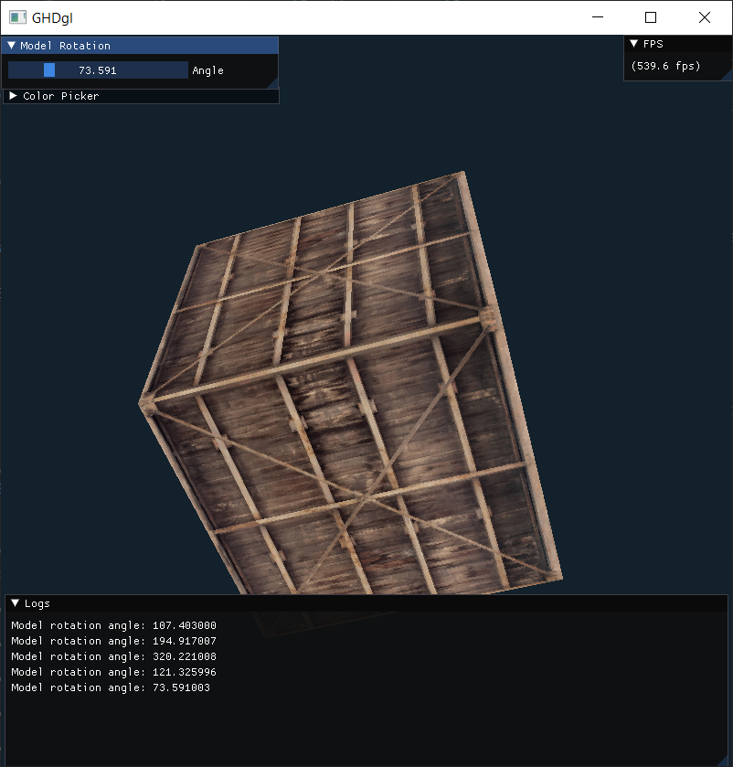
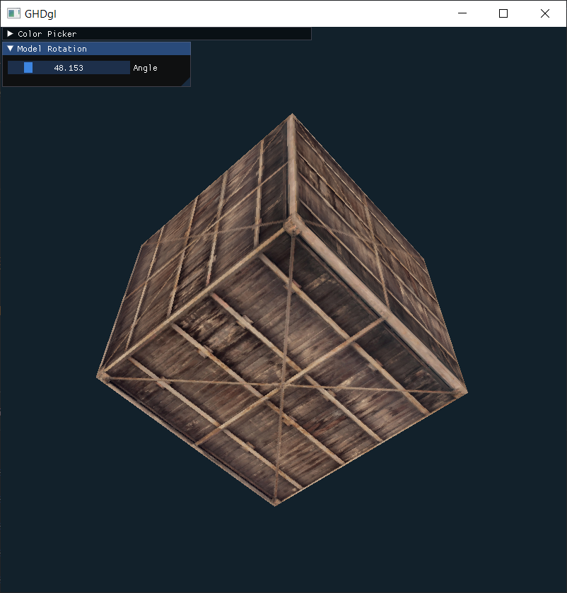
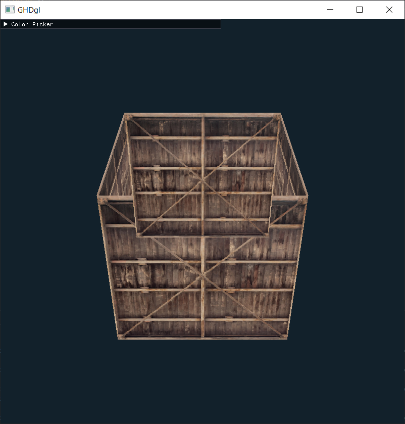
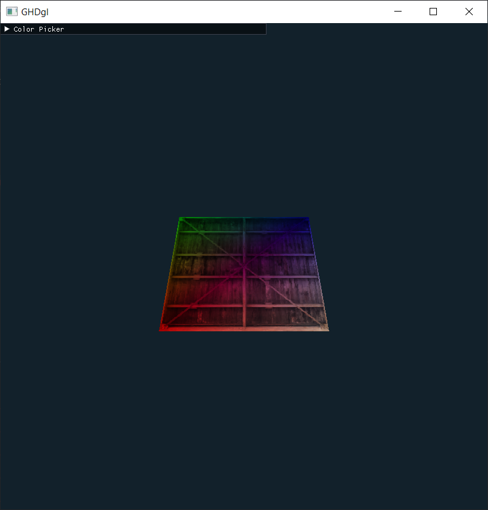
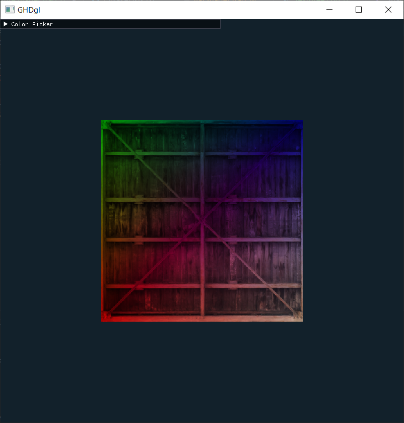
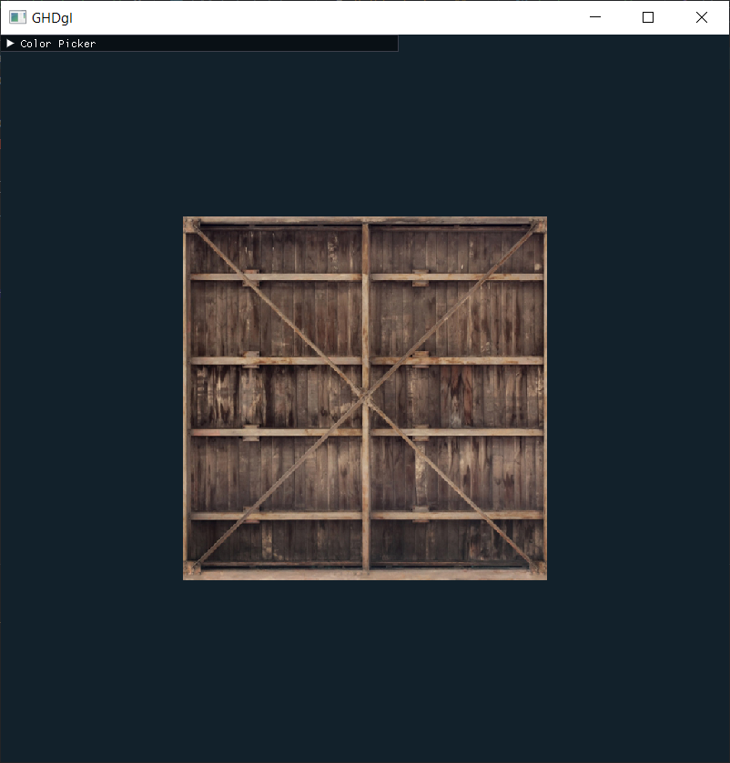
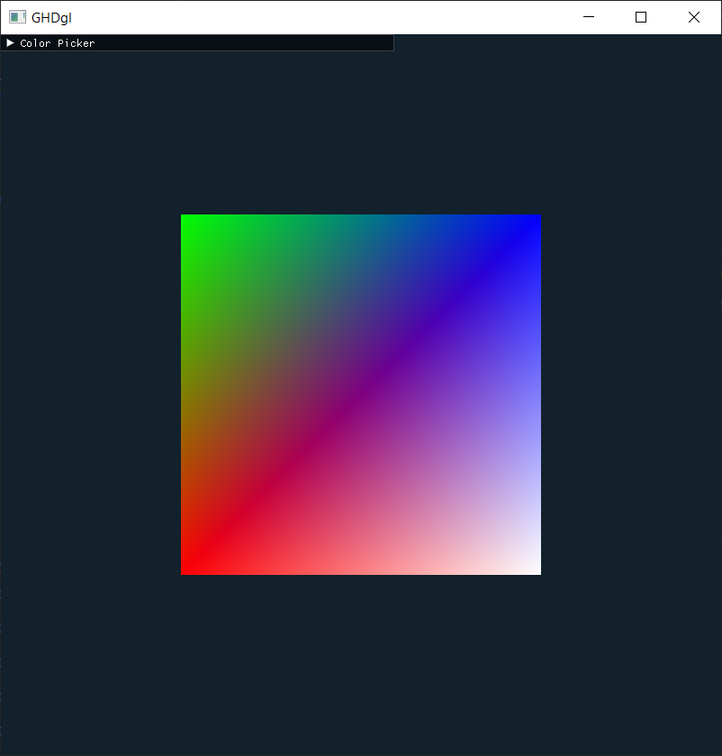
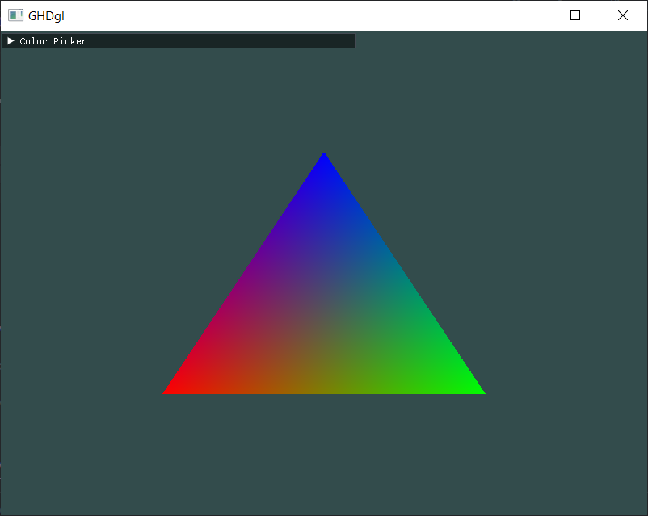

# GHDgl

My personal OpenGL sandbox project.
I plan to implement various OpenGL features and techniques in this project.


Currently tested on Windows 10 (MinGW)

## Dependencies

- CMake 3.29.1 or higher (Could work on older versions)

## Stack

- CMake
- OpenGL
- GLFW3
- GLAD
- GLM
- STB_IMAGE
- IMGUI(Docking)

## Features

- Simple main.cpp hello triangle example
- Color Picker using dearimgui

## TODO

- Add TODO items!

## Build

```bash
$ git clone repo
$ cd GHDgl
$ mkdir build
$ cd build
$ cmake ..
$ cmake --build .
$ ./GHDgl
```

## Demos


1. GUI Update


7. Rotated Cube


6. Cube


5. MVP Matrices


4. Texture mixed with color


3. Simple Texture


2. Square with EBO


1. Triangle with vertex color

