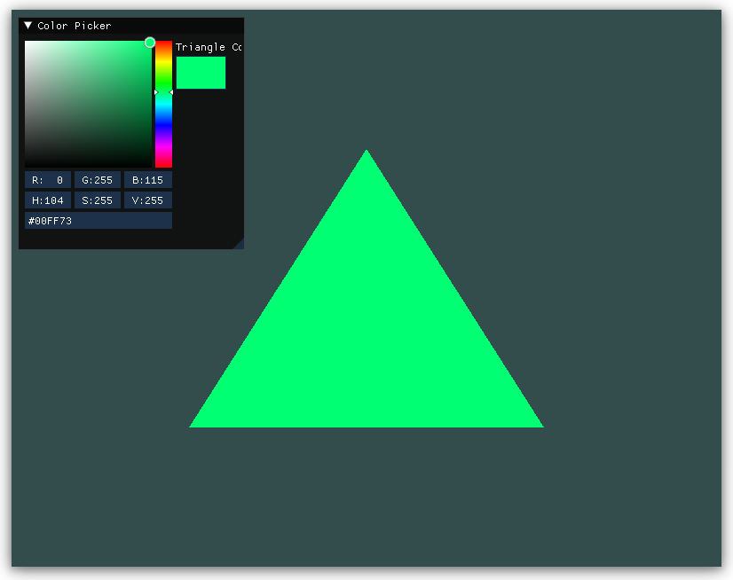

# GHDgl

My personal OpenGL sandbox project.
I plan to implement various OpenGL features and techniques in this project.


Currently tested on Windows 10 (MinGW)

## Dependencies

- Must have glfw3 installed
- Must have cmake installed

## Stack

- CMake
- OpenGL
- GLFW3
- GLAD
- GLM
- STB_IMAGE
- IMGUI(Docking)

## Features

- Simple main.cpp hello triangle example
- Color Picker using dearimgui

## TODO

- Add TODO items!

## Build

```bash
$ git clone repo
$ cd GHDgl
$ mkdir build
$ cd build
$ cmake ..
$ cmake --build .
$ ./GHDgl
```
