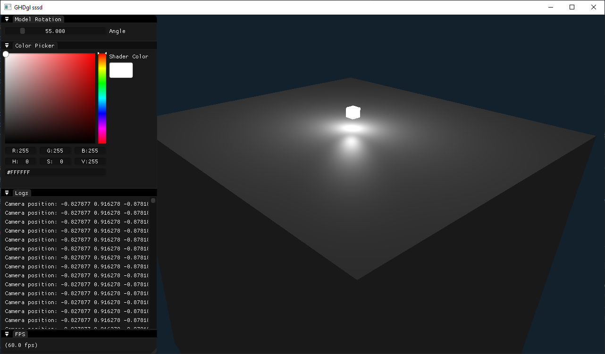

# GHDgl

My personal OpenGL sandbox project.
I plan to implement various OpenGL features and techniques in this project.


Currently tested on Windows 10 (Visual Studio 2022)

## Dependencies

- CMake 3.31 or higher
- You need to build assimp.dll and assimp.lib by your own and place them inside `vendor/assimp/lib`
	- also rename them in `CMakeLists.txt` file if needed.

## Stack

- CMake
- OpenGL
- GLFW 3
- GLAD
- GLM
- STB_IMAGE
- IMGUI (Docking)
- ASSIMP

## Features

- Phong Shader
- Multiple Lights
- FPS Camera Movement
- Textures

## TODO

- [ ] Loading Meshes
- [ ] Fresnel Shader
- [ ] Outline Shader
- [ ] Wireframe Shader
- [ ] Refactoring the whole shit

## Build

```bash
$ git clone repo
$ cd GHDgl
$ mkdir build
$ cd build
$ cmake ..
$ cmake --build .
$ ./GHDgl
```

## Demos

17. Multiple Lights

Implemented multiple lights.


16. Light Attenuation

Implemented light attenuation.


15. Multiple Cubes

Render multiple cubes in a grid.


14. Texture Maps

Diffuse and Specular Texture Maps!


13. Materials

Refactored the shader properties into a Material and Light struct in the fragment shader.


12. Specular Lighting

Implemented Specular lighting using Phong lighting model and visualized the light using a second small cube.


11. Diffuse Lighting

Implemented simple diffuse lighting using Phong lighting model.


10. Normal

Added normal vector to the vertex data and implemented simple normal debugger shader.


9. Camera

Added camera class and implemented camera movement using keyboard and mouse input.


8. GUI Update

Refactored GUI code into a GUI class


7. Rotated Cube


6. Cube


5. MVP Matrices


4. Texture mixed with color


3. Simple Texture


2. Square with EBO


1. Triangle with vertex color


