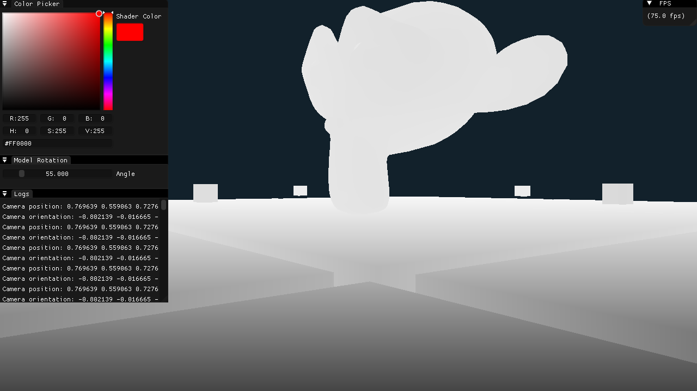

# GHDgl

My personal OpenGL sandbox project.
I plan to implement various OpenGL features and techniques in this project.


Currently tested on Windows 10 (Visual Studio 2022)

## Dependencies

- CMake 3.31 or higher
- You need to build assimp.dll and assimp.lib by your own and place them inside `vendor/assimp/lib`
. also rename them in `CMakeLists.txt` file if needed.

## Stack

- CMake
- OpenGL
- GLFW 3
- glad
- glm
- stb_image
- imgui (Docking)
- assimp

## Features

- FPS Camera Movement
- Blinn-Phong Shading
- Multiple Point Lights
- Loading Models
- Textures

<!-- ## TODO

- [ ] Fresnel Shader
- [ ] Outline Shader
- [ ] Wireframe Shader
- [ ] Normal Shader
- [ ] Refactoring the whole shit -->

## Build

```bash
git clone repo
cd GHDgl
mkdir build
cd build
cmake ..
cmake --build .
./GHDgl
```

**NOTE**:  Also make sure to build `assimp.dll` and `assimp.lib` for you own system and place it in `GHDgl/vendor/assimp/lib`. if your files have different names, either rename them to match or change the corresponding names in `CMakeLists.txt` file.

## Dev Log

### 25. Made the scene better

Changed some lighting values and tweaked some textures. Also replaced suzanne with smoother one.


### 24. A new Scene (Cubes Pile)

Implemented a new scene with a plane and a bunch of cubes for upcoming examples.


Blender viewport for reference (😪):


### 23. Culling

Implemented culling.


### 22. Depth Testing

Here is after changing the depth test func to `GL_ALWAYS`. Displaying the fragments based on the order they were drawn.


### 21. Blinn-Phong Shading

Implemented blinn-phong shading. here is the before after


### 20. Linearize Depth (Depth Visualization)

Convert the non-linear `gl_FragCoord.z` to linear and visualize it. Visit https://github.com/Gholamrezadar/GHDgl/commit/9f066b032e3883c3d11bd801105f39f8600aa53a to view it.

Linear Depth:


Non-Linear (Raw) Depth:



### 19. Model Loading Part 2

Fixed the problems + some extra renders


### 18. Model Loading Part 1

Tried to load meshes but vertex attributes had problems! also building assimp and figuring out how to link it took literally 3 days away from my lifespan.


### 17. Multiple Lights

Implemented multiple lights.


### 16. Light Attenuation

Implemented light attenuation.


### 15. Multiple Cubes

Render multiple cubes in a grid.


### 14. Texture Maps

Diffuse and Specular Texture Maps!


### 13. Materials

Refactored the shader properties into a Material and Light struct in the fragment shader.


### 12. Specular Lighting

Implemented Specular lighting using Phong lighting model and visualized the light using a second small cube.


### 11. Diffuse Lighting

Implemented simple diffuse lighting using Phong lighting model.


### 10. Normal

Added normal vector to the vertex data and implemented simple normal debugger shader.


### 9. Camera

Added camera class and implemented camera movement using keyboard and mouse input.


### 8. GUI Update

Refactored GUI code into a GUI class


### 7. Rotated Cube


### 6. Cube


### 5. MVP Matrices


### 4. Texture mixed with color


### 3. Simple Texture


### 2. Square with EBO


### 1. Triangle with vertex color


